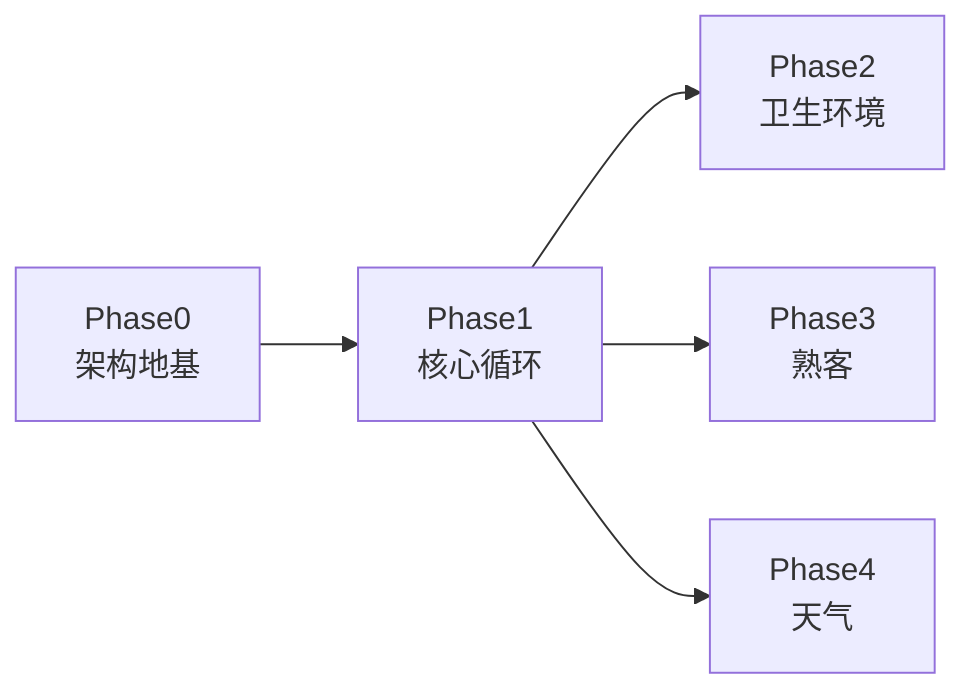

# 实现计划 · 第一波可玩原型

> 配套设计文档：飞书「🍳 休闲烹饪游戏 · 设计文档」
> 目标：最快做出可玩原型，验证「做菜 + 客人焦虑 + 熟客 + 卫生环境」的乐趣。
> 首要原则：**架构地基先行，机制逐个挂载**。可拓展性从第一天就建好，不是事后补救。

---

## 一、可拓展性：5 项地基（缺一不可）

所有「可拓展」最终落到这 5 件事上，这是 Phase 0 的全部内容：

| 地基 | 作用 | 对应「可拓展」的承诺 |
|---|---|---|
| ① 事件总线 EventBus | 系统间零耦合通信 | 加机制 = 新系统订阅事件，不动已有代码 |
| ② 单一数据源 GameState | 纯数据、可单测 | 状态集中，新系统读写同一份数据 |
| ③ 游戏时钟 GameClock | 驱动时间类机制 | 焦虑/卫生/天气都挂在同一个钟上 |
| ④ 系统框架 System + SystemManager | 统一生命周期 | 加机制 = 加一个 system 节点 |
| ⑤ 数据驱动 Resource | 内容与代码分离 | 加菜/客人/天气/事件 = 加数据文件 |

---

## 二、阶段总览

- **Phase 0** 是硬前提（地基，没有它后面无从谈起）。
- **Phase 1** 是「最小可玩闭环」（一个客人进来、点单、做出、结账）。
- **Phase 2/3/4** 都依赖 Phase 1，彼此之间可部分并行。

---

## 三、Phase 0：项目骨架 + 可拓展架构地基

**目标**：搭一个「空」但已经能挂载任意机制的项目。

| 任务 | 交付物 | 验收标准 |
|---|---|---|
| 0.1 项目初始化 | Godot 4 项目、目录规范、主场景、autoload 注册 | 项目能打开、能运行 |
| 0.2 EventBus | 全局事件总线（命名事件 + 发布/订阅） | 广播一个事件，system 能收到 |
| 0.3 GameClock | 游戏内时钟（天/分钟），可变速、可暂停 | 时钟能走、能停、能变速 |
| 0.4 GameState | 纯数据状态（店铺/顾客/时间/天气） | 能读写，脱离渲染可单测 |
| 0.5 System + SystemManager | 系统基类 + 注册器（init/update/cleanup） | 注册一个空 system 能进主循环 |
| 0.6 数据基建 | Recipe / CustomerType / Weather 的 Resource 基类 | 能加载一个 .tres 数据文件 |

**可拓展性验收**：此时还没有任何玩法，但已经能通过「写一个新 system 类 → 注册 → 订阅事件」接入一个机制，全程不改已有代码。

---

## 四、Phase 1：核心循环（最小可玩闭环）

| 任务 | 内容 | 验收 |
|---|---|---|
| 1.1 营业状态机 | 开店 / 营业 / 关店三态 | 能开始、结束一天 |
| 1.2 顾客系统 | 生成客人、进店、点单（数据驱动） | 客人进店并点单 |
| 1.3 制作系统 | 点单 → 2 步制作 → 上菜 → 结账 | 做出菜、上菜、收钱 |
| 1.4 焦虑/满意度 | 耐心条随时间衰减 + 满意度综合计算 | 等久了客人焦虑，满意结账 |

**可玩闭环**：一个客人进店点单 → 你做出菜 → 上菜 → 满意结账。

---

## 五、Phase 2：卫生 + 环境

| 任务 | 内容 | 验收 |
|---|---|---|
| 2.1 卫生系统 | 脏污累积 + 拖地恢复 + 阈值负面 | 脏店 → 客人焦虑加速 |
| 2.2 环境系统 | 环境值 + 对顾客的影响 | 环境差 → 满意度下降 |

---

## 六、Phase 3：熟客最小版（招牌机制）

| 任务 | 内容 | 验收 |
|---|---|---|
| 3.1 熟客数据 | 名字 + 固定点单 | 熟客有名字和固定单 |
| 3.2 识别时刻 | 第 N 次来提示「还是老样子」 | 出现识别提示 |
| 3.3 关系热度 | 宽容度 / 小费随关系涨 | 熟客更宽容、小费更多 |
| 3.4 流失（可挽回） | 怠慢 → 疏远 → 离开 → 和解 | 怠慢会离开，用心能挽回 |

---

## 七、Phase 4：天气最小版

| 任务 | 内容 | 验收 |
|---|---|---|
| 4.1 天气系统 | 晴 / 雨 | 天气能切换 |
| 4.2 天气联动 | 雨 → 客流少 / 地面易脏 / 环境降 | 雨天真实影响玩法 |

---

## 八、测试策略

- 纯函数机制（焦虑衰减、满意度计算、卫生劣化）写成**纯函数**，先写测试。
- GameState 脱离渲染做单元测试。
- 遵循设计文档 §5 的测试规范（正常路径 + 异常/边界路径）。

## 九、风险与注意事项

- **别过早抽象**：先让机制跑通，再抽数据；避免 Phase 0 过度设计。
- **EventBus 别滥用**：状态读取走 GameState，事件只用于「通知变化」，不要拿事件当数据存储。
- **时间尺度**：先定「一天 ≈ 5~8 分钟」，随时可调。

## 十、后续（第二波起）

Phase 1~4 跑通后，再进入第二波：熟客完整化、卫生/环境深化、随机事件库。详见设计文档 `05 · 原型范围与路线图`。
